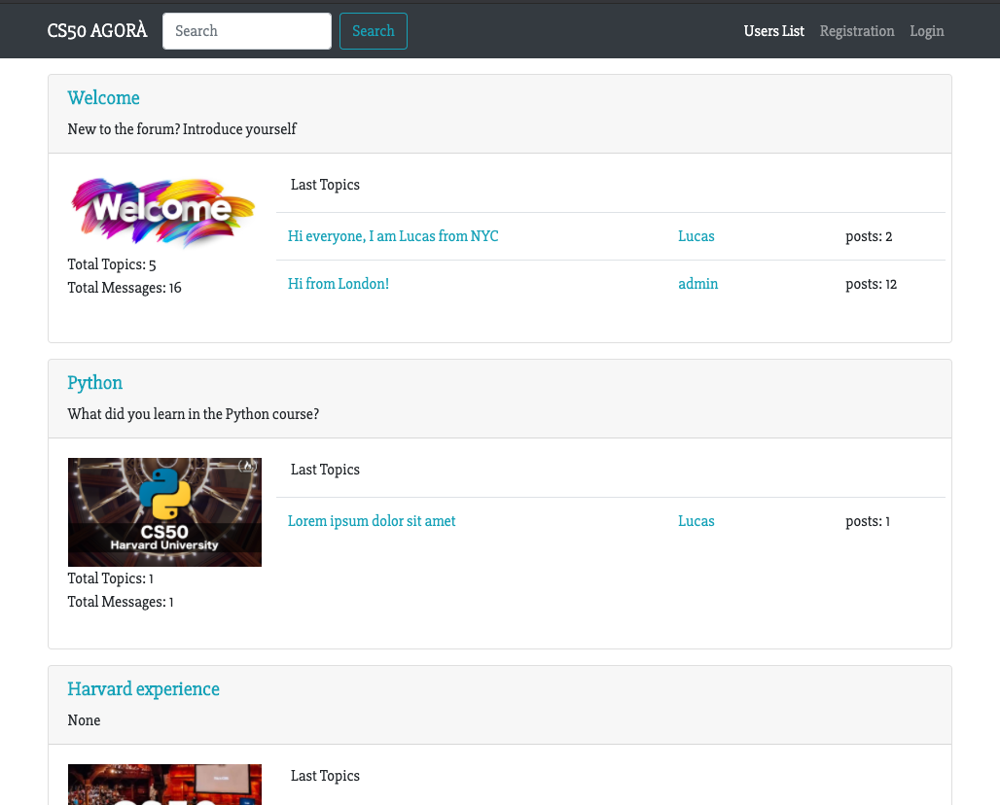
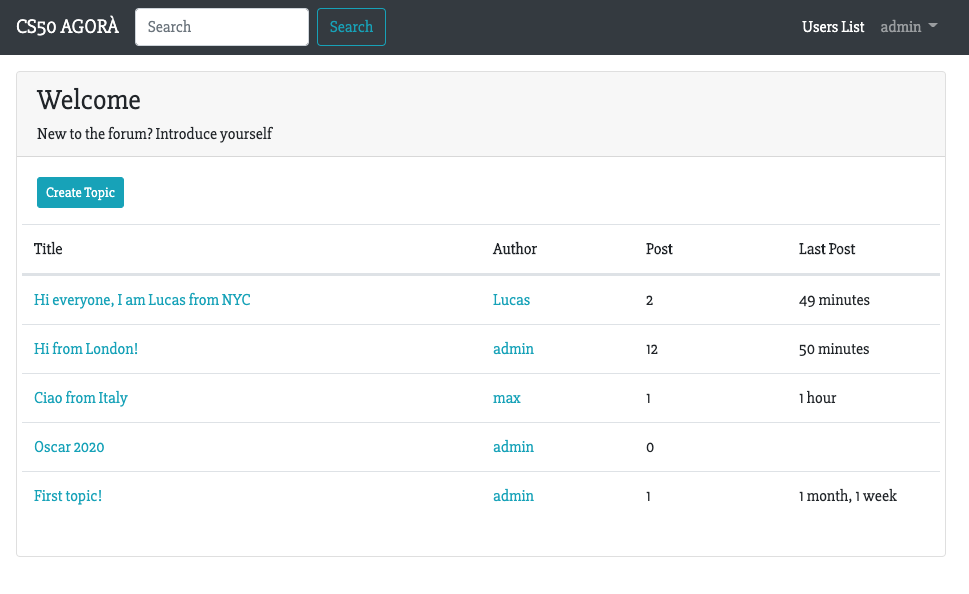

# python-forum-cs50-final-project

This is my final project for [Harvard CS50](https://cs50.harvard.edu/x/2020/) course. It is a Forum / social website project built with Python, Django, SQLite and Bootstrap.

Main features:
- Registration and authentication system with password reset
- Arrange the content in subsections, created by the forum administrators
- Integrated website search function
- Access the user profiles by using `@username` tags, Twitter style
- 100% responsive site for comfortable mobile browsing

## Requirements Installation

`pip install django`

`pip install pillow`

`pip install django_crispy_forms`

## Running the app
1. Activate the virtual environment by running `source myvirtualenv/bin/activate`
2. Go to the `social_site` folder
3. Run `python3 manage.py runserver` and open the localhost port `http://127.0.0.1:8000/`

## Server
Based from Django version 3.0.8, settings at 'social_site.settings'
Development server is available at http://127.0.0.1:8000/

## Access the database
To access to the database you can use the built-in [Django Admin site](https://developer.mozilla.org/en-US/docs/Learn/Server-side/Django/Admin_site#:~:text=To%20login%20to%20the%20site,'ve%20entered%20your%20details).
- run `python3 manage.py runserver`
- To login to the site, open the '/admin' URL (e.g. http://127.0.0.1:8000/admin)

## Future Improvements
 * adding user profile picture
 * edit existing posts
 * rich text in posts
 * private messages
 * night mode

## Home Page

## Topics Page

